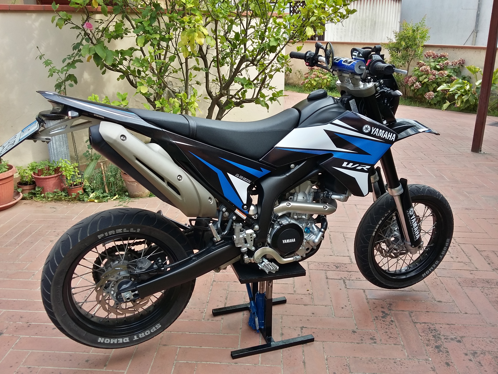
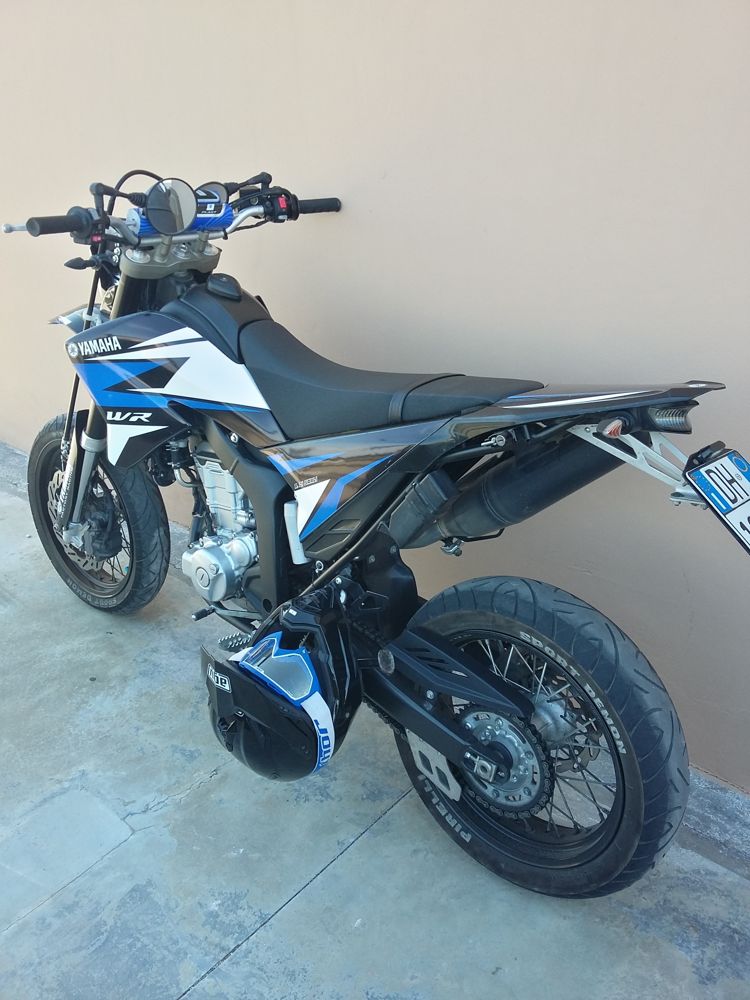

# Yamaha-WR250X-R-Graphics

SVG graphics for Yamaha WR250X and WR250R. Get them here: [graphics.svg](graphics.svg).

As you may know, creating this graphic kit has taken time and effort.
If you've found my graphics kit useful and would like to support me, please consider making a donation to my PayPal account. 
Your donation will go towards helping me create more open source projects that people can use and enjoy.
Any amount is appreciated, and it will help me continue creating and sharing more open source projects like this one. 

**You can donate through my PayPal link https://www.paypal.me/andreadisarli.**

Thank you for your support!

## Tips on installing the graphics kit

1) Remove the plastics from the bike
1) Remove the old graphics
1) Clean the surfaces
1) Apply a mixture of soap and water on the adhesive part of the graphics
1) Place accurately the graphics
1) Use a plastic card to squeeze out the water solution starting from the center
1) Use a needle to remove bubbles
1) Let dry
1) Enjoy!

## Photos

## License

 This work is licensed under a <a rel="license" href="http://creativecommons.org/licenses/by-nc-sa/4.0/">Creative Commons Attribution-NonCommercial-ShareAlike 4.0 International License</a>.
